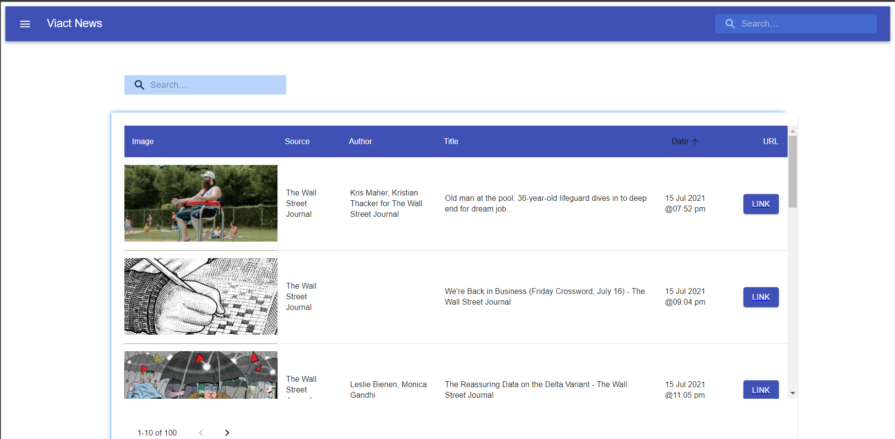

This project demonstrates my experiments on a [Create React App](https://github.com/facebook/create-react-app) with [TypeScript](https://www.typescriptlang.org/) and [Redux](https://redux.js.org/) in order to get to a more production worthy app. This app makes REST calls for listing and searching [News](https://newsapi.org/) content accross the web.

## Goals

- Add testing, test coverage reporting, and approach 100% test coverage.
- Use a scalable file structure, centered around feature/domain.
- Maintain small files and classes.
- Leverage TypeScript's type system as much as possible.

## Project Setup
1. Clone the Repo
2. Create a `.env` file in your project root
3. Copy variables in `.env.sample` file in project root into the `.env` file and set real values
4. Install dependencies using `yarn`

## Available Scripts
In the project directory, you can run:

### `yarn dev`

- Runs the app in the development mode. 
- Open [http://localhost:3000](http://localhost:3000) to view it in the browser.

- The page will reload if you make edits. 
You will also see any lint errors in the console.

### `yarn build`

- Builds the app for production to the `build` folder. 
- It correctly bundles React in production mode and optimizes the build for the best performance.

- he build is minified and the filenames include the hashes. 
Your app is ready to be deployed!

See the section about [deployment](https://facebook.github.io/create-react-app/docs/deployment) for more information.

### `yarn start`

- Runs the built app in production mode. 
- Open [http://localhost:5000](http://localhost:5000) to view it in the browser.

- The page will not reload if you make edits. 
You will also not see any lint errors in the console.

### `yarn eject`

**Note: this is a one-way operation. Once you `eject`, you can’t go back!**

- If you aren’t satisfied with the build tool and configuration choices, you can `eject` at any time. This command will remove the single build dependency from your project.

- Instead, it will copy all the configuration files and the transitive dependencies (Webpack, Babel, ESLint, etc) right into your project so you have full control over them. All of the commands except `eject` will still work, but they will point to the copied scripts so you can tweak them. At this point you’re on your own.

- You don’t have to ever use `eject`. The curated feature set is suitable for small and middle deployments, and you shouldn’t feel obligated to use this feature. However we understand that this tool wouldn’t be useful if you couldn’t customize it when you are ready for it.

## Learn More

- You can learn more in the [Create React App documentation](https://facebook.github.io/create-react-app/docs/getting-started).

- To learn React, check out the [React documentation](https://reactjs.org/).
